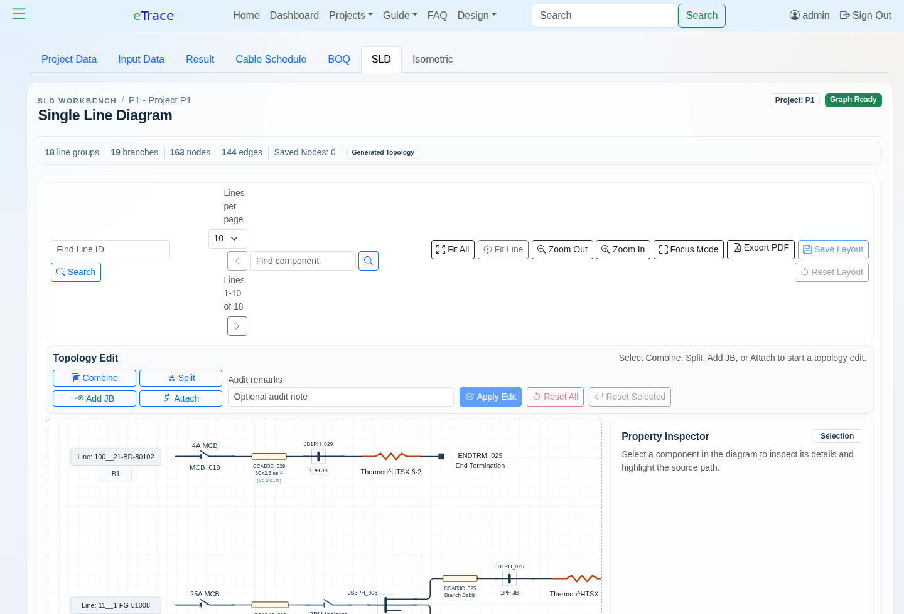
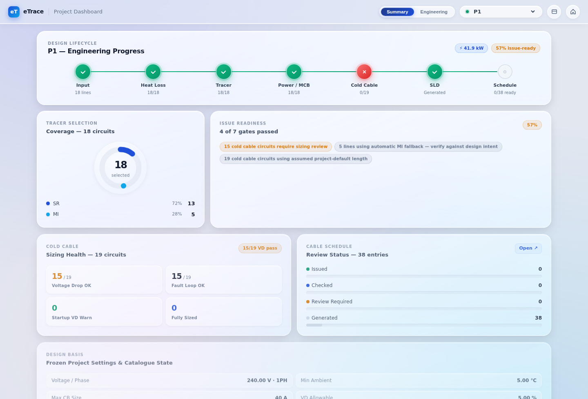
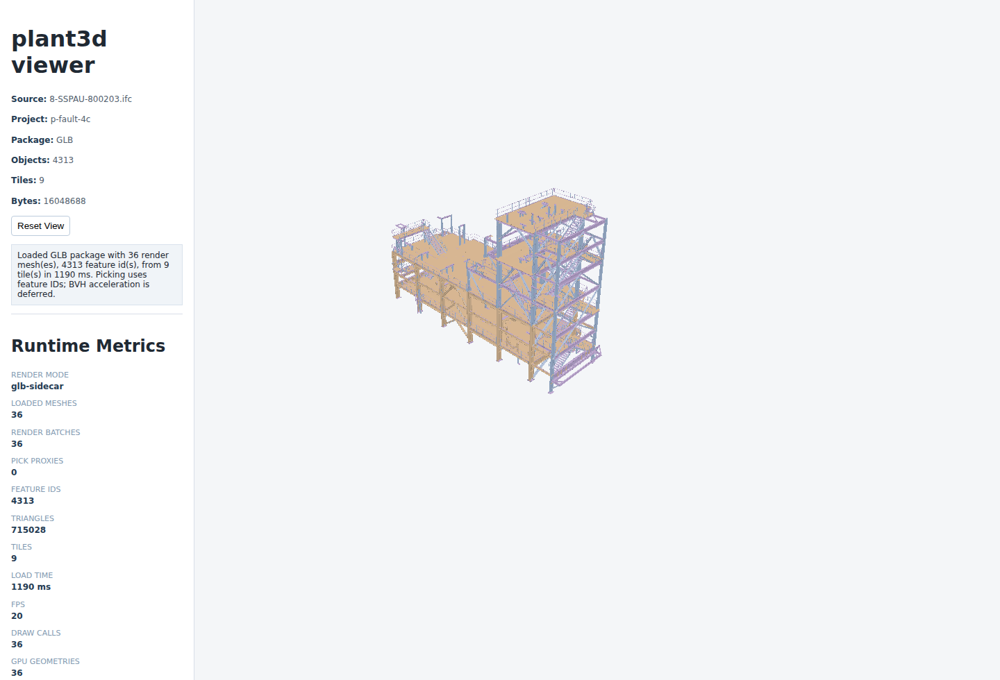

# eTrace: Electrical Heat Tracing Design Software

Prepared for a potential investor / collaborator discussion

## The Short Version

I am building eTrace, a web-based engineering platform for electrical heat tracing design.

Electrical heat tracing is one of those industrial design areas that is everywhere in oil and gas, chemicals, power, utilities, and process plants, but the software support is still surprisingly fragmented. Engineers still spend a lot of time moving between Excel sheets, vendor catalogues, CAD drawings, cable schedules, single line diagrams, manual checks, and review comments. The work is technical, repetitive, and high consequence. A small mistake in design basis, cable selection, voltage drop, or routing can turn into procurement rework, site delays, or unsafe installations.

eTrace is meant to bring that workflow into one connected system.

The first product is focused on pipeline heat tracing: calculate the heat loss, select the heating cable, size the electrical circuits, generate BOQ and cable schedule outputs, build the single line diagram, and keep enough calculation evidence that another engineer can review why the software made a decision.

Longer term, the ambition is bigger: connect heat tracing engineering with the plant model itself, including isometrics, IFC/3D structure, cable trays, trench/duct routing, and eventually model-assisted plant electrical design workflows.

This is not a generic SaaS dashboard. It is domain software for a real engineering workflow that is still underserved.

## The Problem In Plain English

In a process plant, many pipelines need to be kept warm. Sometimes it is to stop a fluid from freezing. Sometimes it is to maintain viscosity. Sometimes it is for process reasons. Electrical heat tracing does this by running a heating cable along the pipe and powering it from electrical distribution panels.

Designing that properly is not just "choose a cable".

An engineer has to know the pipe size, pipe length, insulation, minimum ambient temperature, maintain temperature, operating/design temperature, area classification, temperature class, vendor catalogue limits, power supply voltage, circuit breaker limits, voltage drop, local isolator philosophy, junction box layout, and cable routing assumptions. Then that design has to become drawings, schedules, BOQ, procurement quantities, and review evidence.

Most tools solve only one slice of this. Vendor tools help choose vendor products. Spreadsheets help calculate, but they are hard to audit and easy to break. CAD tools show geometry, but do not understand the engineering calculation. Project deliverables are then manually stitched together.

eTrace is my attempt to make the full workflow feel like one engineering system.

## What Is Developed

The current application is already a working Django-based engineering system. It is not only a prototype screen.

### 1. Project Setup And Line List Import

The app can create project design basis data and import piping line-list input from Excel. The project setup captures practical design settings such as ambient conditions, voltage, circuit breaker limits, voltage drop allowance, vendor selection, heat-loss method, RTD/thermostat basis, isolator philosophy, and cable length assumptions.

The imported line list carries the pipe data: line ID, P&ID, area, service, pipe size, pipe length, insulation type/thickness, maintain/operating/design temperature, accessory counts, and review status.

This matters because the line list is normally where the engineering work starts.

### 2. Heat-Loss And Heating Cable Selection

The system calculates heat loss for insulated pipelines and selects suitable heating cable. The current hot-engineering path supports self-regulating cable as the normal default, and it includes a bounded MI fallback path for lines where SR is not suitable because of temperature limits or heat-duty limitations.

The calculation stores evidence, not just final numbers. For example, it records heat-loss basis, selected tracer, alternate/rejected options, voltage basis, circuit count, breaker sizing, and selection diagnostics.

For a reviewer, this is important. They should not have to guess why a line passed or failed.

### 3. MI Heating Cable Fallback

Mineral insulated cable is handled as a separate calculation path, not as a disguised SR cable. That is important because MI engineering has different constraints: heater set length, resistance-temperature correction, cold leads, hot-cold joints, sheath temperature, circuit current, and catalogue validation.

The current MVP supports validated MI catalogue gating, MI heater selection, cold-lead options, identical multi-set selection where one heater set is not enough, and downstream reporting into BOQ, cable schedule, and SLD.

### 4. Cold Cable Sizing

The application now includes cold cable sizing, which is a major step beyond basic heat-tracing selection.

Cold cables are the power cables feeding the heating circuits. The system checks ampacity, voltage drop, fault-loop behavior, RCD-related review state, 4C/3C cable combinations, per-outgoing branch sizing, conductor mass, and review-required cases. It can separate feeder cable and branch cable logic and record why a selected cable size is acceptable or not.

This is one of the places where eTrace starts to become more than a calculator. It connects heating load to real electrical distribution consequences.

### 5. BOQ And Cable Schedule

The app generates BOQ and cable schedule outputs from the active engineering data.

The BOQ covers heating cable, accessories, local isolators, labels, cold cables, and related quantities. The cable schedule includes generated quantities, manual overrides, cold-cable status, voltage-drop/fault-loop evidence, and review status.

This is useful because procurement and construction teams do not consume a calculation formula. They consume quantities, cable schedules, tags, drawings, and issue packages.

### 6. Single Line Diagram Workbench

The SLD workbench is one of the strongest pieces already developed.

The SLD is generated from stored power-distribution branch data. It has a browser workspace, saved layout positions, validation, PDF export, component search, line filtering, topology edit tools, and visual review states. It supports controlled engineering edits such as combine feeders, split circuits, add downstream distribution JB, and attach/move branches.

Those edits are not loose drawing edits. They are stored as topology operations with audit and review state, so downstream BOQ and cable schedule impact can be tracked.

### 7. Project Dashboard

There is also a project dashboard that gives a quick read on the engineering lifecycle: input, heat loss, tracer selection, power/MCB, cold cable, SLD, and schedule.

For the current P1 demo project, the dashboard shows a realistic state: 18 circuits covered, SR/MI split, cold-cable sizing health, issue readiness, cable schedule status, project basis, and review warnings.

This is the kind of screen that lets a lead engineer or project manager know where the design stands without opening five different spreadsheets.

### 8. Verification And Test Foundation

The codebase has a meaningful test suite and documented verification work. The current notes record hundreds of passing tests around calculation, reporting, SLD behavior, topology edits, cold cable sizing, and browser smoke checks.

The documentation also includes a calculation user manual, design guide, worked examples, release checklist, audit notes, and roadmap files. It is not all polished marketing material, but that is a good sign in this stage. It shows the product is being built with engineering traceability in mind.

### 9. Early 3D / Plant Model Platform

The newer `plant3d` workstream is the beginning of a neutral 3D engineering platform inside the same product ecosystem.

The current spike can ingest IFC files, convert them into browser render packages, create GLB/tiled package outputs, index model objects, preserve feature IDs, and render them in a Three.js browser viewer. A local package currently loads a GLB model with 9 tiles, 36 render meshes, and 4,313 feature IDs in roughly 1.2 seconds in the test capture.

This is still a platform foundation, not the final plant-design product. But it proves a key point: the software is moving toward connecting engineering calculation with actual plant geometry.

## Why This Is Different

The important difference is not that eTrace can calculate heat loss. Many spreadsheets can calculate heat loss.

The difference is that eTrace is being built as a connected engineering workflow:

- Project setup drives calculation.
- Line list drives heat tracing scope.
- Catalogue data controls selection.
- Heating cable selection drives electrical load.
- Electrical load drives circuit and breaker sizing.
- Circuit topology drives SLD.
- SLD and topology drive cable schedule.
- Cold cable sizing feeds back into review state and voltage evidence.
- BOQ and reports come from the same stored engineering data.
- Future 3D routing can feed real route lengths back into the sizing engine.

That closed loop is the product.

For a software founder, I would frame it this way: eTrace is not trying to be "Excel but online". It is trying to become the system of record for a narrow but valuable industrial engineering workflow.

## Commercial Use Case

The first customer profile is likely an EPC contractor, engineering consultant, or heat-tracing design team handling multiple industrial projects.

The immediate value is:

- Reduce spreadsheet dependency.
- Reduce repeated manual checking between calculation, SLD, BOQ, and cable schedule.
- Make design assumptions visible.
- Create traceable review evidence.
- Shorten the cycle between input line list and engineering deliverables.
- Help less experienced engineers follow a disciplined workflow.
- Give senior engineers faster review visibility.
- Build a reusable project data foundation for future model-based routing and optimization.

The product could also be useful for heat-tracing vendors, but I see EPCs and engineering consultants as the cleaner first adoption path because they feel the pain of coordination across deliverables.

## What Is Planned

### 1. Production Hardening Of Current Workflow

The near-term goal is to finish hardening the existing SR/MI + cold cable + SLD workflow. This includes final visual checks, large-project browsing, release acceptance, catalogue validation decisions, dependency/admin hardening, and demo walkthrough cleanup.

The current app is already strong enough for serious review, but I do not want to overstate it as a fully certified commercial engineering platform yet.

### 2. Constant Wattage / Constant Power Cable

Constant wattage cable is planned as a separate calculation module. It should not reuse SR assumptions incorrectly. It needs its own catalogue model, selection method, current/breaker integration, BOQ, cable schedule, SLD output, and worked examples.

### 3. More Advanced Heat-Loss Methods

The current heat-loss method is practical and documented. Future versions should add more advanced methods: better external convection/wind model, vendor or project accessory tables, multi-layer insulation, vendor curve interpolation, and clearer method selection per project.

### 4. 3D Model-Based EHT Design

This is the big next product layer.

The plan is to connect IDF/PCF piping isometrics, IFC plant/structure models, and EHT design overlays into one composite 3D workspace. The user should be able to import model layers, align coordinates, show/hide layers, inspect line IDs, place EHT components, and connect the physical model back to the calculation data.

The immediate work is not a full CAD replacement. It is model-assisted engineering: use the model to validate routing, reduce manual measurement, catch mismatches, and improve deliverable quality.

### 5. Cable Tray, Trench, Duct Bank, And Routing Graphs

Once the model workspace is stable, the next major step is route infrastructure: cable trays, trench, duct bank, pull pits, routing nodes, and cable paths.

This is where eTrace can become very valuable. Today, cold cable length is often assumed or manually estimated. If the product can derive or validate route length from model geometry, the cable sizing, voltage drop, BOQ, and construction package become much more reliable.

### 6. Plant Electrical Design Platform

The architecture deliberately separates `plant3d` from EHT-specific logic. That means the 3D platform can later support other EPC electrical workflows: cable routing, cable drum optimization, construction pull planning, electrical equipment placement, model review, and field progress tracking.

In other words, EHT is the first deep vertical workflow. The platform can expand from there.

### 7. Collaboration, Review, And Issue Workflow

The future product should include designer/checker/approver roles, revision control, issue packages, review comments, and status workflows. This matters in engineering because the final deliverable is not just a calculation. It is an approved design package.

## Demo Flow I Would Show

For a live demo, I would keep it simple:

1. Start with the dashboard to show the project lifecycle and review state.
2. Open project setup and show how the design basis is captured.
3. Show imported line data.
4. Open results and show heat-loss, SR/MI selection, and diagnostics.
5. Open cold cable results and show voltage drop / fault-loop evidence.
6. Open BOQ and cable schedule to show deliverables.
7. Open the SLD workbench and show that topology is data-backed, not just a drawing.
8. Finish with the 3D viewer to show where the product is going.

That demo tells the story better than screenshots alone.

## Collaboration Angle

What I would like to discuss is not only funding. I am looking for the right kind of software/product thinking around this.

The domain knowledge is deep and specific. The software opportunity is to package that domain knowledge into a product that engineers can actually trust. That means the product needs solid architecture, careful UX, a good data model, and a practical go-to-market path. It also needs restraint, because in engineering software, overpromising kills trust quickly.

My view is that eTrace can start as a focused EHT design product, prove value in a narrow workflow, and then expand into broader EPC electrical design and model-based engineering.

The market will not be as loud as consumer SaaS, but the pain is real, the workflows are expensive, and the current tools are not where they should be.

